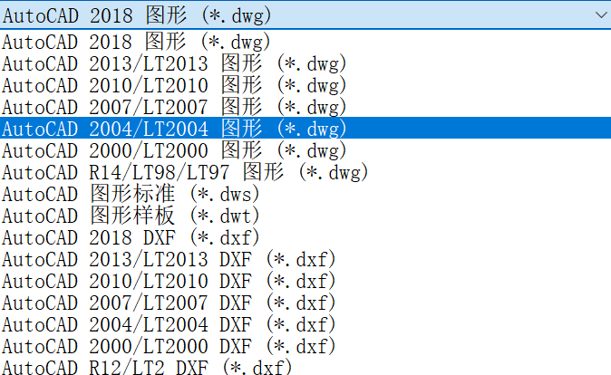

[CC98 原帖链接](https://www.cc98.org/topic/6132879)
## 感悟
昨日还在为WEDM折腾了2h，其间抉择了好一会儿到底应该去打哪张图片，时不时又搜了搜过往的WEDM经验帖，对被前辈们吐槽的那位“老”WEDM任课教师十分害怕，并且已经做好了今天工训课做个人机，不碰手机、不在老师喊动之前操作、全程听从老师安排。

没错，**WEDM任课教师换了**，貌似是今年刚换的，因为我问去年上过该课程的学长也说老师很凶，而且授课态度几乎与前辈所言有180°大反转。在发现眼前的老师不是前辈们口中的那个脾气差差的老师后，我勇敢提问，问了保留部分和去除部分的区别、乳白色冷却液是什么成分等等问题，老师都很耐心并且和蔼地解答，还没开始上课我就已经听到老师说了好多次 **“没事”“稍等哈”“好的好的”** 。

实操过程中他见到有同学看手机也是很和蔼地提醒，因为他是任课老师，如果有人走过来看到他带的学生在看手机而不是看实践操作他会很难堪，而且大部分时间都是在机房画图度过的，实际电火花切割时间很短很短，长的15min，短的7-8min就好了。大家上课可以不用一个个排队等着把u盘插在老师的电脑里上传的，机房的电脑都是一个局域网里，**在“网络”里可以完成所有的上传预习作业、课堂作业的操作。**

原本还在为本次工训担忧，现在想来是目前上下来最轻松而且收获知识最多的一节工训课，前几节赶集式的实践真的很难记住什么东西……

## 课程经验
### 课程任务
WEDM主要任务就是使用CAD软件绘制一个图案的轮廓线，并且在铝板上用电火花切割将其切下来，而后者几乎全为机控，因此实质的挑战就在于前者的CAD轮廓图绘制。

轮廓图的要求有

1. **图形封闭**，也就是一笔画完
2. **保留部分**不少于1mm，**去除部分**不少于0.1mm

**保留部分**可以理解作你要保留下来的一个线段，例如你想要打出来一支箭，那么这个箭的宽度应不小于1mm。

**去除部分**可以理解成我们为了一笔画完该图案所切进去的狭长口，这部分不小于0.1mm即可

学在浙大里提供的教程让我们跟随着图片一笔一笔地勾勒，但lz怎么会甘于将时间用在这种机械式的操作，于是乎lz使用了R2V软件将图案扣出轮廓线并且直接导入CAD，这一步可以节省几乎80%的时间，剩下的20%就是选择图片并且将轮廓线处理成一笔画完即可。（虽然lz用了80%时间选图片……）

### 轮廓线的简化处理方法

以下我提供一个我自己找的破解版：[R2V-PlutoKirin](https://pan.baidu.com/s/1DymWWIG-IAzrPpCRD6LCjA?pwd=vg1a)

我们需要用到R2V软件，官网为[R2V](https://r2v.ablesw.com/download.html)，步骤我简略写在下面。

- 打开软件，在"R2V License"处 Continue 后，选择自己想要的图片
- 在菜单栏 'Image' 内选择 'Conversion' → '24-bit RGB - > GrayScale' ，也就是将图片转换为灰度图，方便矢量图的生成
- 在菜单栏 'Vector' 内选择 'Auto Vectorize' ，在弹出的对话框中更改设置为 'Image Source: CAD Drawing' & 'Extract Lines for: Boundary Line' ，then 'Start' 即可
- 在菜单栏 'File' 内选择 'Export Vector...' ，将保存类型改为 'DXF Files' 再保存到本地（因为DXF格式可以导入CAD）
- 将保存的DXF文件直接拖到CAD中，先调成尺寸为40\*40，可以先画一个40\*40的方框再将轮廓图缩放到方框里以确定大小，其实这里的40\*40并非绝对的标准，稍微大些也没关系，该尺寸限制主要是为了一块板能打出更多的东西
- 选中我们的轮廓线，切换成英文键盘打入 'Explode' 并且确认，就可以将完整的轮廓线切成一条条直线和圆弧线，其中轮廓线无法被机器识别并加工，只有一条一条的直线和圆弧线才可以。
- 在这之后只要切出需要的不少于0.1mm的线，使我们的图形可以一笔画完就可以啦。

**注意，CAD文件的保留格式要选用CAD2004版本，否则机房软件可能会出错**

---

我的预习作业……之前分不清楚保留部分和去除部分为了保险就都用了1mm……

因为时间比较紧，两两分组，我们组选用了另一位小伙伴的图案，贴吧表情也没打出来。

最后祝各位同学工训课课程顺利，能够打出自己喜欢的图案。