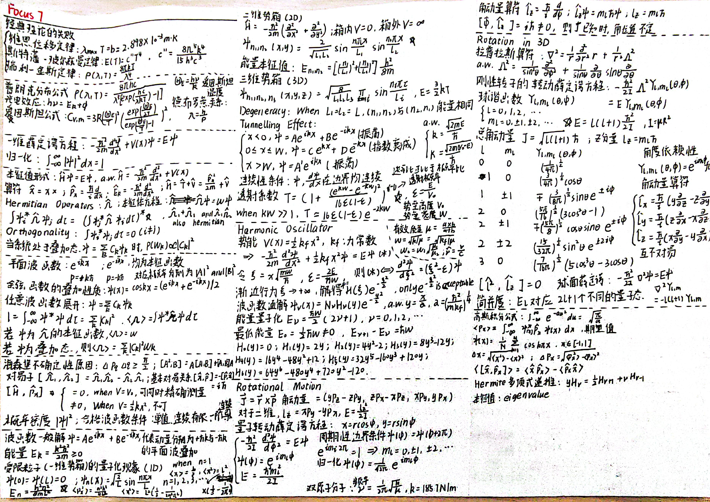
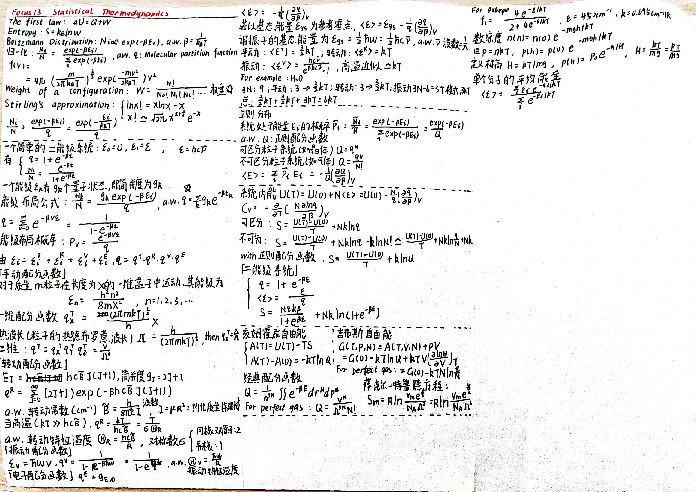

# 25-26秋冬 物理化学（英）（4.0学分）丨Kenji Mochizuki
## Course Overview
- 评价体系：平时30%+期中35%+期末35%
- 考试形式：A4双面半开卷

本课程面向于非化学系的与化学相关的专业，我所修读的是望月老师的全英版本，修读压力上个人体感比中文班要小得多，此处的体感多来自于与中文班同学在期中周和期末周的交流。

望月老师上课上得十分用心，可以从他的全手搓ppt，导出为pdf后10来页却有着20+MB的大小的可以看出，我十分喜欢望月老师的上课劲头，但是不可避免的口音和语言屏障会让上课变得些许困难。签到形式是以每节课都会有的 **Quiz** 形式开展的，大抵就是发一张A4然后做一做ppt上的小测试，并不是小测计分的形式。

> **一间教室找不出一个英语母语者。**

这是我的朋友在期中考试教室考前跟我吐槽的话。教室里仅有的一位留学生应该是俄罗斯人。

之所以我认为修读压力会小于中文物化，是因为望月老师所教的物理化学是外国的经典体系，给我的感觉是十分面向学科基础，当然没有认为这样修读会很简单的意思。以期末考为例，考试内容为 **Focus 7: <mark style="background: #D2B3FFA6;">Quantum theory</mark>**, **Focus 13: <mark style="background: #D2B3FFA6;">Statistical thermodynamics</mark>**, **Focus 14: <mark style="background: #D2B3FFA6;">Molecular interactions</mark>**，也就是量子理论、统计热力学、分子间作用三个部分，非常的物理而不怎么化学！准备期末给我的感觉就是在修读一门“大学物理 plus”。

> “The average is 59.”望月老师期中考后如是说。

可能是因为期中考得太难了，期末试题都在面向推导公式和定义，很好地跟我的准备方向相错😄😭。

## Knowledge Outline
> [!warning] 悲报！
> 我并没有好好做笔记，我忏悔。

### FOCUS 1 The Properties of gases

### FOCUS 2 The First Law

### FOCUS 3 The Second and Third Laws

### FOCUS 4 Physical transformations of pure substances

### FOCUS 5 Simple mixtures

### FOCUS 7 Quantum theory

### FOCUS 13 Statistical thermodynamics

### FOCUS 14 Molecular interactions

## Exam Prep
因为是半开卷，所以一定要给自己<mark style="background: #FF5582A6;">提前两天的时间量</mark>来准备微雕，25-26秋冬的期中偏向公式的应用和应用，因期中的 Average point 是 59，期末偏向了基本公式的推导，很常见的题型就是 **"Derive this function ……"**。

The recommended way for me to prepare for the exam is to go through the PowerPoint presentation, which is something I missed. Then consolidate the knowledge based on the <mark style="background: #FFF3A3A6;">Exercises</mark> and <mark style="background: #FFF3A3A6;">Problems</mark> after class.

至于微雕，我能够分享的也只是期末的微雕，仅供参考。

← If you want to get a PDF version, you can look at another file in the current directory.

平日里上课尽可能地去适应望月老师的口音吧，如果能在大二就适应全英文课堂我想是一件很酷的事情！

当然如果你觉得语言壁垒完全隔绝了你和本门课的缘分，我推荐你去修读[【【Atkins物理化学】全球第一个Atkins物理化学教程！】](https://www.bilibili.com/video/BV1J34y1S7xa?vd_source=a4117bb68d81a24e2489f1341d3d7857)，但是截止至2026年1月14日，游魂老师并非更新 Focus 13 & 14 的讲解视频，如果在你修读的时候能够有相关的更新，那我真的会十分羡慕你！
## Reflection on Study
物理化学是我在 ZJU 修读期间接触的第一门全英授课的非语言类课程，感觉还是很奇妙的，期中我考的并不是很好，期末目前也没有给出成绩，但是我觉得物理化学真的很好地提升了我的专业英语水平……

至于给我带来的学习感悟，就是一定要在修读前多多看看有没有什么网课资料可以参考。像游魂老师的 B站大学 课程版本，就是我朋友在期中考后的那个下午发现并且分享给我的。期中考后的 Focus 13 &14 又用不上了😭😭😭。