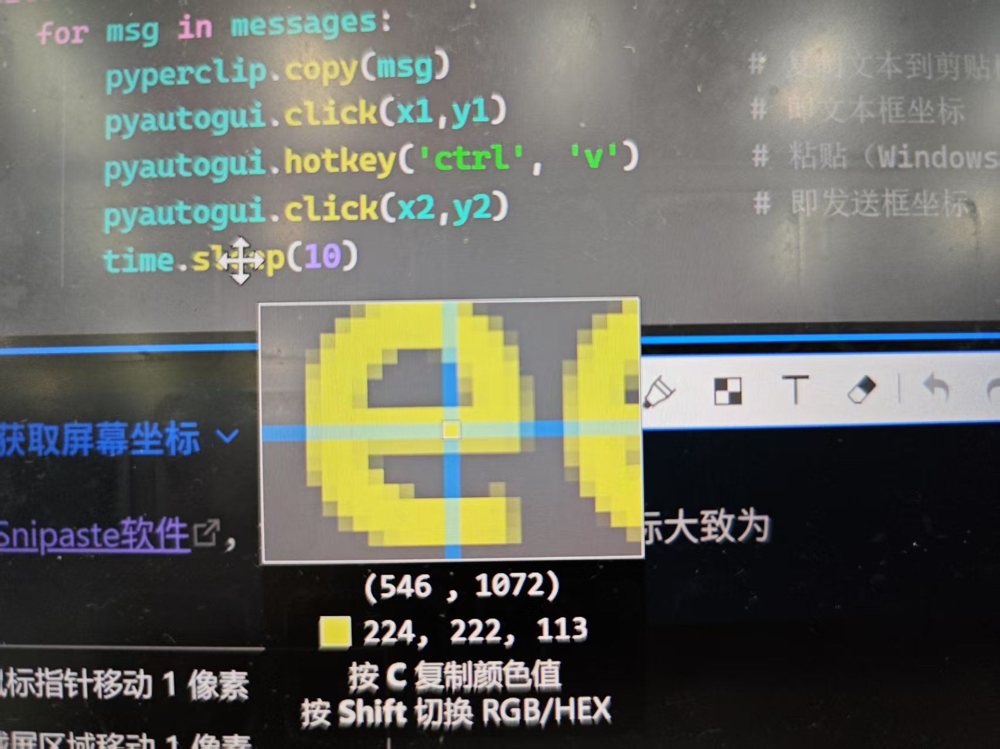

# 基于pyautogui的慧学外语Etalk自动实现

## 原理
所需环境：pyautogui、[网页版慧学外语](https://elang.zju.edu.cn/#/home)

在`messages`中储存发送的文本->将文本复制到剪贴板->点击屏幕上的输入框->粘贴内容->点击发送进行发送文本->暂停10s以给Etalk回答时间
## 具体操作
### 环境配置
`pip install pyautogui`

### 代码
Pycharm、Vscode均可
```python
import pyautogui  
import pyperclip  
import time  
  
messages = ["Who are you?", "I'm happy to talk with you", "How are you?"]  
while True:  
    for msg in messages:  
        pyperclip.copy(msg)                # 复制文本到剪贴板  
        pyautogui.click(x1,y1)             # 即文本框坐标  
        pyautogui.hotkey('ctrl', 'v')      # 粘贴（Windows）  
        pyautogui.click(x2,y2)             # 即发送框坐标
        time.sleep(10)
```

>[!note]+ 获取屏幕坐标
>用[Snipaste软件](https://dl.snipaste.com/win-x64-cn)，如下图所示，代码的坐标大致为`(550,1070)`
>

### 让你的电脑空跑100min即可